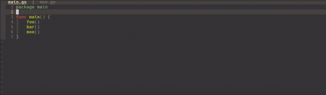

# better-tabs.nvim

> A minimal Neovim plugin that implements window-specific buffer management.


`better-tabs` completely changes the Neovim buffer + window workflow. Each window maintains its own buffer list with tab-like navigation and visual indicators.



## Features

- **Per-window buffer lists** - Each window manages its own independent buffer list
- **Winbar integration** - Visual buffer indicators in each window's winbar
- **Buffer navigation** - Navigate buffers within a window using keymaps
- **Move buffers between windows** - Transfer buffers to adjacent windows
- **LSP diagnostics** - Shows error/warning counts in the winbar
- **Modified indicators** - Shows `[+]` for unsaved buffers
- **Telescope integration** - Browse all buffers across windows
- **Window-aware cleanup** - Smart buffer deletion when windows close

## Requirements

- Neovim 0.11 (probabbly work on other versions too)
- Telescope (optional, for the buffer picker)

## Installation

Using [lazy.nvim](https://github.com/folke/lazy.nvim):

```lua
{
  "mkeiji/better-tabs.nvim",
  config = function()
    require("better-tabs").setup()
  end,
},
```

Using [packer.nvim](https://github.com/wbthomason/packer.nvim):

```lua
use("mkeiji/better-tabs.nvim")
```

## Configuration

```lua
require("better-tabs").setup()
```

## Commands

| Command | Description |
|---------|-------------|
| `:BetterTabsNextBuffer` | Navigate to next buffer |
| `:BetterTabsPrevBuffer` | Navigate to previous buffer |
| `:BetterTabsMoveNext` | Move buffer to next window |
| `:BetterTabsMovePrev` | Move buffer to previous window |
| `:BetterTabsCloseBuffer` | Close current buffer from window |
| `:BetterTabsCloseOthers` | Close other buffers in window |
| `:BetterTabsClose` | Clear all buffer ownership from window |
| `:BetterTabsInfo` | Show current window's buffer list |
| `:BetterTabsAll` | Show all windows' buffer info |
| `:BetterTabsTelescopeBuffers` | Telescope buffer picker (requires Telescope) |
| `:BetterVSplit` | Vertical split with buffer ownership |

## Winbar Indicators

The winbar displays:
- Buffer name (truncated to filename)
- `[+]` if buffer is modified
- `[Xe/Yw]` for LSP diagnostics (errors/warnings)

## How It Works

Unlike traditional buffer management where buffers are global, better-tabs.nvim gives each window its own buffer list. When you:

- **Navigate**: Cycles through buffers owned by the current window only
- **Split**: Moves the current buffer to the new window, leaving the original window with remaining buffers
- **Close window**: Deletes buffers only if no other window owns them
- **Move buffer**: Transfers buffer ownership to another window

## Trade-offs

This will likely break your current Neovim workflow, as `better-tabs` uses a completely different approach to window/buffer management.
- You will need to adapt to this new workflow.
- You lose the fancy interactive buffer line (if you use any)

## Telescope Integration

When Telescope is installed, `:BetterTabsTelescopeBuffers` opens a buffer picker that:
- Lists all buffers across all windows
- Shows which window owns each buffer
- Focuses the owning window when selected

## 🤝 Contributing

I only plan to keep minimal maintenance on this plugin (except for breaking changes in the Neovim API).
BUT, contributions are welcome! Please feel free to submit a Pull Request. For major changes, please open an issue first to discuss what you would like to change.

## License

MIT License - see [LICENSE](LICENSE) for details.
